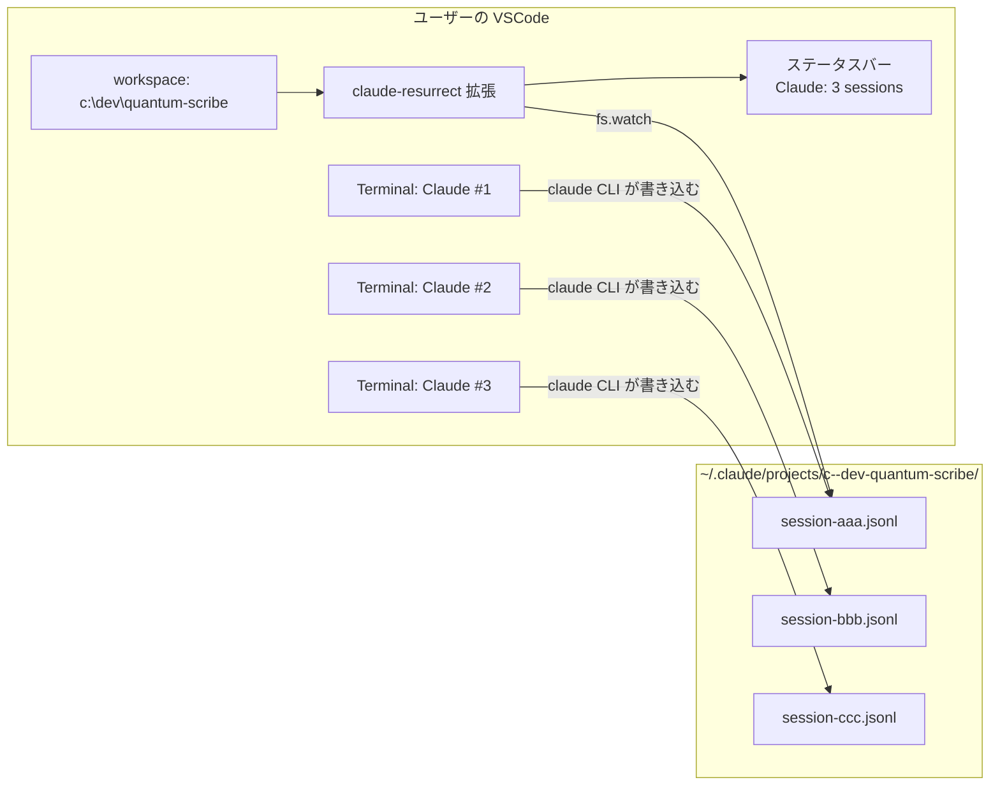
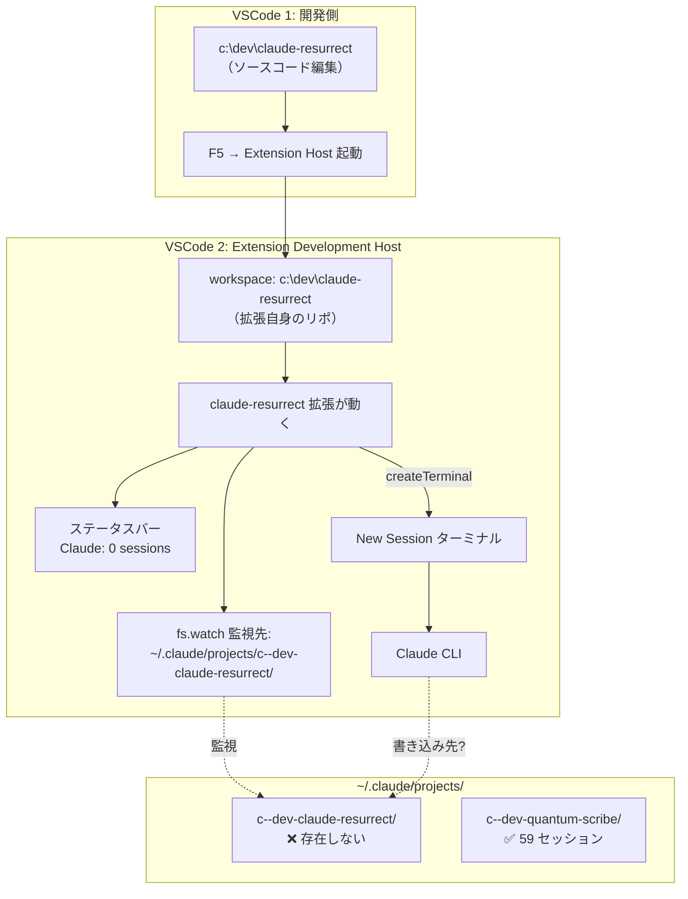

# セッション検知デバッグ — 構造図

## 2つのレイヤー

### 本番 UX（実際のユーザー体験）

ポイント: **ワークスペース = 実プロジェクト**。拡張とCLIが同じプロジェクトスラグを参照する。

---

### F5 開発テスト（現在の状態）

**問題**: Extension Dev Host のワークスペースが `claude-resurrect`（拡張のソースコード自体）なので、
テスト時に Claude セッションが作られても、本番 UX の動作を再現していない。

---

## 気づき

| 観点 | 本番 UX | F5 テスト（現状） |
|------|---------|-------------------|
| ワークスペース | 実プロジェクト（quantum-scribe 等） | 拡張自身のリポ（claude-resurrect） |
| 既存セッション | あり（59件等） | なし（0件） |
| 拡張の監視先 | 既存セッションがあるディレクトリ | 空のディレクトリ |
| テストの意味 | 実シナリオ | 自己参照的で不自然 |

## 結論

F5 テストで本番の動作を確認するには、Extension Dev Host が開くフォルダを
**既にセッションがある実プロジェクト**にすべき。
