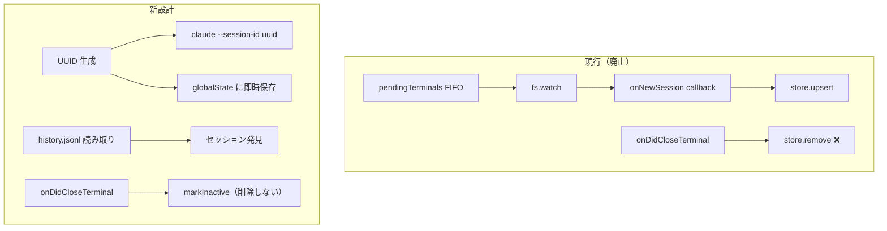
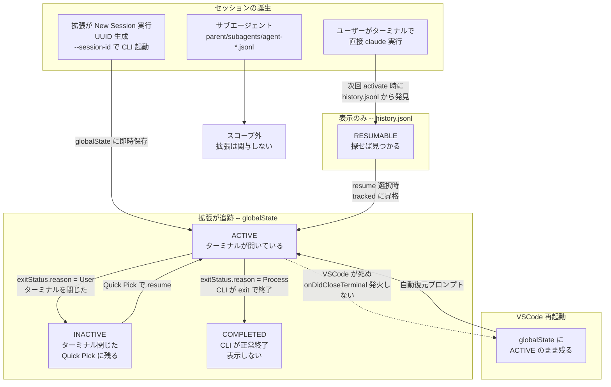
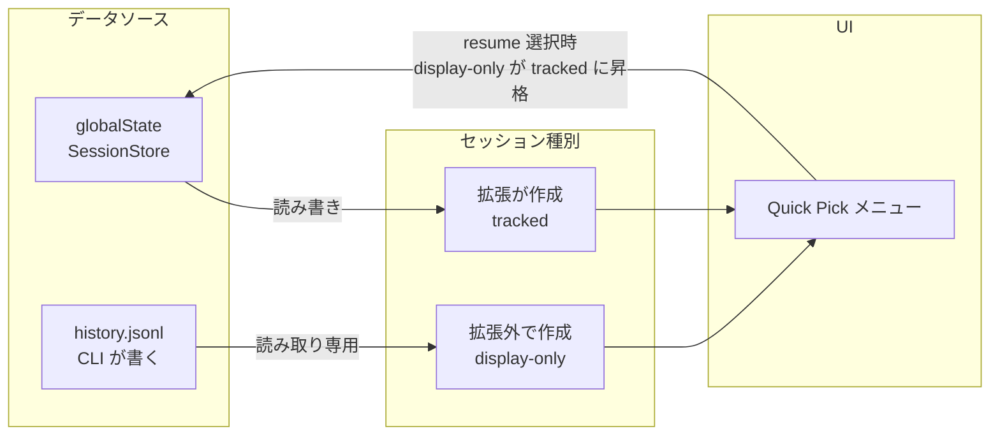

# セッション管理の再設計

## 経緯

### なぜ再設計するか

初期実装（#4）は「動くものを先に作る」方針で、以下の仮定に基づいていた:

1. `fs.watch` で `~/.claude/projects/<slug>/` を監視し、新しい `.jsonl` ファイルの出現でセッション作成を検知
2. `pendingTerminals` FIFO キューで「最近作ったターミナル」と「新しく出現したセッション」を紐付け
3. `onDidCloseTerminal` でセッション記録を削除

Issue #5, #6, #7 の調査で以下が判明し、これらの仮定がすべて破綻:

| 仮定 | 事実 | 出典 |
|------|------|------|
| slug は `path.toLowerCase().replace(/[:\\/]/g, "-")` | CLI は `path.replace(/[^a-zA-Z0-9]/g, "-")`（toLowerCase なし） | #5 comment 1 |
| FIFO で紐付ければ正しい | 2つのターミナルを素早く作ると逆順にマッチする可能性 | コードレビュー |
| ターミナル閉じたら記録削除 | 閉じた後に復元するのが目的なので、削除したら意味がない | #7 MoSCoW |
| `deactivate()` で状態を保存 | PC 再起動・クラッシュ時に呼ばれない | #7 VSCode ライフサイクル調査 |
| fs.watch は信頼できる | プラットフォーム差異、ネットワークドライブ問題、タイミング問題 | #6 Terminal API 調査 |

### 新しいアプローチの着想

調査中に `claude --session-id <uuid>` フラグの存在を確認（CLI ヘルプで実証済み）。
これにより:

- **拡張側で UUID を生成** → `claude --session-id <uuid>` でセッション作成
- セッション ID は**ターミナル作成前に確定**
- `fs.watch` も `pendingTerminals` も**不要**

---

## 要件の再確認

> 今開いているワークスペースに対応する Claude Code セッションを一覧表示し、ワンクリックで再開する。

### Must Have（v1）

1. 現在ワークスペースのセッション一覧表示
2. セッション再開（`claude --resume <id>`）
3. VSCode 再起動後のセッション情報保持
4. 新セッション作成と即時追跡
5. Windows CWD ケース対応

### Should Have

6. セッションの表示名（最初のユーザー入力）
7. 「最新セッションを続行」ショートカット（`claude --continue`）
8. アクティブ/非アクティブ状態の区別

### Won't Have（v1 スコープ外）

- ターミナル出力の復元（VSCode API 制約で不可能）
- 全プロジェクト横断の resume（ワークスペース単位で十分）
- Claude Code SDK の直接呼び出し

---

## ユーザーストーリー

### 得られる UX

**朝、VSCode を開く。**
昨夜 VSCode がクラッシュして中断された2つのセッションが、自動的にターミナルで再開される。`claude --resume ...` が走り、昨夜の会話の続きからそのまま作業できる。ステータスバーには `$(terminal) Claude: 2 sessions` と表示されている。

**作業中、新しいセッションを始める。**
Quick Pick から "New Session" を選ぶ。ターミナルが開き、Claude が起動する。裏では拡張が UUID を発行して `claude --session-id` で起動しているが、ユーザーには見えない。

**セッションが終わった。**
Claude に `/exit` と打つ。CLI が終了する。Quick Pick を開くと Completed 欄に `✓` 付きで残っている。邪魔にはならないが、過去の作業が見える。必要なら選んで再開もできる。

**ターミナルを手で閉じた。**
ターミナルタブの × ボタンで閉じた。でもセッション自体は消えない。Quick Pick を開けば Resumable 欄にいる。必要になったらいつでも再開できる。

**昨日ターミナルで直接 `claude` を叩いた。**
拡張を経由しなかったセッションも、Quick Pick を開けば見つかる。history.jsonl から自動で発見される。

### 得られない UX

**ターミナルの出力は戻ってこない。**
セッションを再開しても、前回のターミナルに表示されていたテキスト（コード差分、エラーメッセージ等）は復元されない。VSCode Terminal API の制約で不可能。Claude の会話履歴は CLI 側が保持しているので、Claude 自身は前回の文脈を覚えている。

**別プロジェクトのセッションは見えない。**
quantum-scribe を開いているとき、MathDesk のセッションは表示されない。プロジェクトごとにウィンドウが分かれる前提。

**過去のセッション一覧は無限には伸びない。**
Quick Pick に表示するセッションは最新 N 件に制限される。古いセッションを再開したければ `claude --resume` をターミナルで直接叩く。

---

## 設計

### アーキテクチャ変更の概要



### セッションのライフサイクル



### 状態ごとの振る舞い

| 状態 | 自動復元 | Quick Pick 表示 | 態度 |
|------|---------|----------------|------|
| active（VSCode 再起動で残った） | する | `●` Active 欄 | プロアクティブに復元を提案 |
| inactive（ターミナルを閉じた） | **しない** | `○` Resumable 欄 | パッシブ — 探せば見つかる |
| completed（CLI が exit で終了） | しない | `✓` Completed 欄 | 見えるが邪魔しない。選べば再開可能 |
| resumable（history.jsonl 由来） | しない | `○` Resumable 欄 | パッシブ — 探せば見つかる |

### データソースの役割



### セッション発見（既存セッションの検出）

**方法**: `history.jsonl` を読み、`project` フィールドとワークスペースパスを case-insensitive 比較。

```
history.jsonl の各行:
  { "project": "C:\\dev\\quantum-scribe", "sessionId": "abc-123", "display": "やあ", "timestamp": ... }

ワークスペースパス: "c:\\dev\\quantum-scribe"

normalize("C:\\dev\\quantum-scribe") === normalize("c:\\dev\\quantum-scribe")
→ マッチ → sessionId "abc-123" はこのプロジェクトのセッション
```

**利点**:
- slug 生成が不要（`project` は元のフルパス）
- case-insensitive 比較で Windows のケース問題を回避
- CLI のバージョンアップで slug 実装が変わっても影響しない

**パフォーマンス**: history.jsonl は一度読んでキャッシュ。ファイルサイズは現在 867 行で十分小さい。

### 新セッション作成

```typescript
// 1. UUID を生成
const sessionId = crypto.randomUUID();

// 2. globalState に即座に保存
store.upsert({
  terminalName: `Claude #${nextNumber}`,
  sessionId,
  projectPath: workspacePath,
  lastSeen: Date.now(),
  status: "active",
});

// 3. ターミナル作成 + コマンド送信
const terminal = vscode.window.createTerminal({ name: `Claude #${nextNumber}` });
terminal.sendText(`claude --session-id ${sessionId}`);
```

**順序が重要**: 保存 → ターミナル作成。ターミナル作成中にクラッシュしても、セッション ID は保持される。

### セッション再開

```typescript
const terminal = vscode.window.createTerminal({ name: `Claude: ${displayName}` });
terminal.sendText(`claude --resume ${sessionId}`);

store.upsert({
  ...existingMapping,
  terminalName: terminal.name,
  lastSeen: Date.now(),
  status: "active",
});
```

### ターミナル終了時

```typescript
vscode.window.onDidCloseTerminal((terminal) => {
  const reason = terminal.exitStatus?.reason;

  if (reason === vscode.TerminalExitReason.Process) {
    // CLI が自分で終了（exit, /exit 等）→ 完了
    store.markCompleted(terminal.name, projectPath);
  } else {
    // ユーザーがターミナルを閉じた、または不明 → 復元候補
    store.markInactive(terminal.name, projectPath);
  }
  updateStatusBar();
});
```

### ステータスバー表示

- `$(terminal) Claude: 3 sessions` — 発見された全セッション数
- クリック → Quick Pick メニュー

### Quick Pick メニュー

```
━━━ Active ━━━
  ● Claude #1 — 「このコードを...」 (2m ago)
  ● Claude #2 — 「テストを追加...」 (5m ago)
━━━ Resumable ━━━
  ○ 「リファクタリング...」 (3h ago)     ← inactive: ターミナルを閉じた
  ○ 「バグ修正の調査...」 (1d ago)      ← history.jsonl から発見
━━━ Completed ━━━
  ✓ 「テスト追加」 (1d ago)             ← CLI が exit で正常終了
  ✓ 「初期セットアップ」 (3d ago)
━━━ Actions ━━━
  + New Session
  ↻ Continue Last (claude --continue)
```

全状態のセッションが Quick Pick に表示される。アイコンと欄で区別。completed を選んでも resume 可能。

---

## ファイル別の変更内容

### claude-dir.ts → 大幅変更

**廃止**:
- `projectPathToSlug()` — slug 生成自体が不要に（history.jsonl ベースで発見）
- `watchProjectDir()` — fs.watch 不要に
- `getSessionDisplayName()` — 非効率な逐次検索

**新規**:
- `discoverSessions(workspacePath)` — history.jsonl を読み、ワークスペースに対応するセッション一覧を返す
- `readHistoryEntries()` — history.jsonl のパースとキャッシュ
- `normalizePath(path)` — case-insensitive パス比較用

**残存**:
- `getClaudeDir()` — そのまま
- `listSessionIds()` — フォールバック用に残す（history.jsonl に記録がない古いセッションの発見）

### session-store.ts → 中程度の変更

**変更**:
- `SessionMapping` に `status: "active" | "inactive" | "completed"` フィールド追加
- `remove()` → `markInactive()` / `markCompleted()` に分割
- `getRestorable()` — inactive かつ TTL 内のセッションを返す（completed は含めない）

**新規**:
- `merge(discovered)` — 発見されたセッションと既存マッピングの統合

### extension.ts → 大幅変更

**廃止**:
- `pendingTerminals` 配列
- `fs.watch` 関連コード
- `onDidCloseTerminal` → `store.remove()`

**変更**:
- `startNewSession()` — `--session-id <uuid>` を使用
- `showQuickPick()` — active/inactive 分類、continue last オプション
- `activate()` — 起動時に `discoverSessions()` + `store.merge()` で一覧構築
- `onDidCloseTerminal` — `store.markInactive()` を呼ぶ

### types.ts → minor 追加

```typescript
export interface SessionMapping {
  terminalName: string;
  sessionId: string;
  projectPath: string;
  lastSeen: number;
  firstPrompt?: string;
  status: "active" | "inactive" | "completed";  // 追加
}
```

---

## 実装フェーズ

### Phase 0: `--session-id` 検証（ブロッカー）

全設計が `--session-id` フラグに依存するため、実装前に手動検証する:

```bash
claude --session-id 550e8400-e29b-41d4-a716-446655440000
```

検証項目:
- [ ] セッションが作成されるか
- [ ] `.jsonl` ファイル名が指定した UUID になるか
- [ ] `history.jsonl` の `sessionId` が指定した UUID と一致するか
- [ ] `history.jsonl` の `project` フィールドに CWD が正しく記録されるか
- [ ] 既存 UUID を指定した場合の挙動（エラー or 既存セッション接続）

**判断**: 検証 OK → Phase 1 へ / NG → 設計見直し

### Phase 1: データ層（claude-dir.ts + types.ts）

1. `types.ts` に `status` フィールド追加
2. `normalizePath()` を共有ユーティリティとして切り出し（`session-store.ts` の既存実装と統合）
3. `discoverSessions()` 実装（history.jsonl 読み取り + パス比較）
4. `readHistoryEntries()` 実装（パース + キャッシュ）
5. `watchProjectDir()`, `projectPathToSlug()`, `getSessionDisplayName()`, `listSessionIds()` 廃止
6. テスト追加

`listSessionIds()` は廃止する。フォールバックとして残す案もあったが、slug 生成の修正が必要になり複雑さが増すだけなので、history.jsonl 一本に絞る。history.jsonl に記録がないセッション（ユーザー入力なし）は復元する価値もない。

### Phase 2: ストア層（session-store.ts）

1. `remove()` → `markInactive()` / `markCompleted()` に分割
2. `markCompleted` は以降の `markInactive` で上書きされない保護（completed は終端状態）
3. `getRestorable()` を inactive かつ TTL 内に限定
4. `fromState()` でデシリアライズ時の `status` 欠損補完: `status ?? "inactive"`
5. `status` フィールドの既存テスト更新 + 新規テスト追加

`merge()` は作らない。データソースの役割を明確に分離する:
- **globalState**（SessionStore）: 拡張が作成・追跡したセッションの権威ソース。書き込み可能。
- **history.jsonl**（discoverSessions）: CLI が記録したセッションの読み取り専用参照。表示用。

`activate()` 時に両方を読み、UI に統合して表示する。永続化は globalState のみ。

### Phase 3: UI 層（extension.ts）

1. `pendingTerminals` 廃止
2. `startNewSession()` を `--session-id` 方式に変更
3. `onDidCloseTerminal` で `exitStatus.reason` を見て `markInactive` / `markCompleted` を分岐
4. `activate()` で `discoverSessions()` 呼び出し + globalState 読み出し → 統合表示
5. `autoRestoreSessions()` を globalState に active のまま残ったセッションのみ対象に修正（VSCode 再起動時のみ発動）
6. `claudeResurrect.resumeAll` コマンド廃止 → Quick Pick の "Continue Last" に置換
7. Quick Pick UI 更新（active/inactive/completed 3欄分類）
8. `autoRestore` 設定の説明文更新（セマンティクス変更: 全セッション → VSCode 再起動で中断された active セッションのみ）
9. テスト更新

### 🔍 確認ターン: Phase 1 完了時

**レビュー内容**:
- [ ] `discoverSessions()` が正しくセッションを発見するか
- [ ] テストが通るか（`npm run test`）
- [ ] history.jsonl の実データで動作するか

**判断**: Go / 修正 / 中止

---

## リスク

| リスク | 影響 | 対策 |
|--------|------|------|
| `--session-id` の挙動が想定と異なる | 設計全体が崩壊 | **Phase 0 で検証（ブロッカー）** |
| history.jsonl のフォーマットが CLI アップデートで変更 | セッション発見が壊れる | 構造検証 + エラー時の graceful degradation |
| history.jsonl が巨大になった場合 | 起動が遅くなる | 末尾から N 行だけ読む、またはタイムスタンプフィルタ |
| resume 時に session ID が変わるバグ (#12235) | 追跡が途切れる | resume 後の新 ID は追跡不要（元 ID のファイルに追記される） |
| 既存 globalState に status フィールドがない | ランタイム undefined | `fromState()` でデシリアライズ時に `status ?? "inactive"` で補完 |

## 複雑度: 中

3ファイルの大幅変更だが、各変更は独立しており段階的に検証可能。

---

## 批評レビュー結果

### 第1回レビュー（計画初版）

| 指摘 | 対応 |
|------|------|
| `--session-id` 検証がリスク表の注釈に留まっている | Phase 0 としてブロッカータスクに昇格 |
| 既存 globalState の status 欠損 | Phase 2 に `fromState()` での補完ロジック追加 |
| `merge()` の仕様が不明確 | merge() を廃止。globalState = 書き込み、history.jsonl = 読み取りの分離に変更 |
| `autoRestoreSessions` の扱いが不明 | Phase 3 に明記（active のみ対象、VSCode 再起動時のみ発動） |
| `resumeAll` コマンドの扱いが不明 | Phase 3 で廃止 → Quick Pick の "Continue Last" に置換と明記 |
| `normalizePath` が 2 ファイルに重複 | Phase 1 で共有ユーティリティに統合 |
| `listSessionIds()` フォールバックの slug バグ | フォールバック自体を廃止（history.jsonl 一本化） |

### 第2回レビュー（3状態ライフサイクル導入後）

| 指摘 | 対応 |
|------|------|
| completed が history.jsonl から幽霊復活する | completed も Quick Pick に表示する方針に変更。除外ロジック不要に |
| Phase 0 に history.jsonl の project フィールド検証が欠けている | Phase 0 チェックリストに追加 |
| completed → inactive への退行競合 | Phase 2 に「completed は終端状態、markInactive で上書きしない」保護を追加 |
| `autoRestore` 設定のセマンティクス変更が breaking change | Phase 3 に設定説明文の更新を追加 |
| `Extension` 終了理由が暗黙的に inactive 扱い | 意図的。コードコメントで明示する（Phase 3） |
| Quick Pick の history.jsonl 由来セッション件数上限が未定 | ユーザーストーリーに「最新 N 件制限」として明記 |

---

## F5 手動テスト手順

Extension Development Host はワークスペースなしで起動する。
拡張は `vscode.workspace.workspaceFolders` に依存するため、テスト前にフォルダを開く必要がある。

**制約**: VSCode はフォルダを排他的に握る。他のインスタンスで開いているフォルダは選べない。
テスト用に他で開いていないフォルダを使うこと。

### 手順

1. F5 で Extension Development Host を起動
2. **フォルダを開く**（「ようこそ」画面 → 「フォルダーを開く」で、他の VSCode で開いていないフォルダを選ぶ）
3. ステータスバー右側に `Claude: N sessions` が表示されることを確認
4. ステータスバーをクリック → Quick Pick が開く
   - 「Actions」セクションに「New Session」「Continue Last」がある
   - history.jsonl にそのプロジェクトの履歴があれば「Resumable」セクションにも表示される
5. 「New Session」選択 → ターミナルが開き `claude --session-id <uuid>` が実行される
6. ターミナルの × ボタンで閉じる → ステータスバーのカウントが変わる（inactive に遷移）
7. もう一度 Quick Pick を開く → さっきのセッションが「Resumable」に表示される
