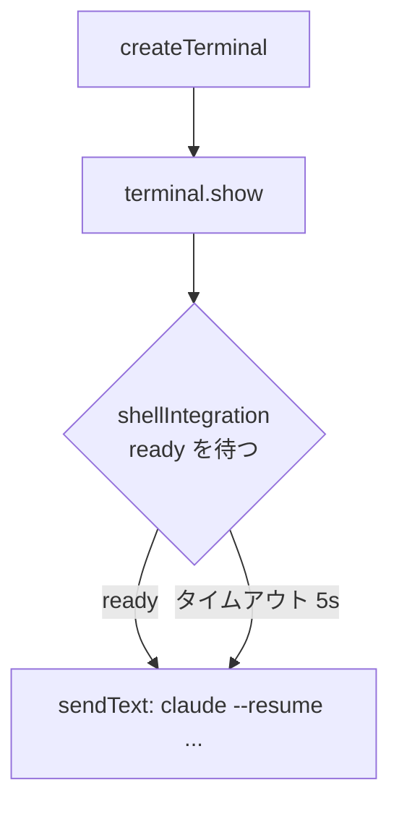

# WSL2 環境での sendText 競合によるシェルエラー

## 現象

WSL2 環境で autoRestore が実行されると、ときおり以下のエラーが発生する：

```
/bin/bash: -c: line 1: unexpected EOF while looking for matching `''
```

毎回ではなく、不定期に発生する。

## 原因分析

`resumeSession` / `startNewSession` で `createTerminal` 直後に `sendText` を呼んでいる：

```typescript
// extension.ts:229-234
const terminal = vscode.window.createTerminal({
  name: terminalName,
  cwd: projectPath,
  isTransient: true,
});
terminal.sendText(`${getClaudePath()} --resume ${sessionId}`);
```

WSL2 のターミナルはネイティブより起動が遅いため、bash がまだ `.bashrc` 等の初期化スクリプトを実行中に `sendText` のコマンド文字列が stdin に流れ込むことがある。`.bashrc` 内のシングルクォートを含む行のパース中にコマンドが混入すると、bash がクォートの対応を誤認し `unexpected EOF while looking for matching '` となる。

タイミング依存のため再現性が不安定。

## 修正方針

`sendText` の前に VS Code の Shell Integration API を使い、シェルの準備完了を待つ。



### ヘルパー関数

- `terminal.shellIntegration` が既に存在 → 即座に `sendText`
- 未存在 → `onDidChangeTerminalShellIntegration` イベントを待つ
- 5 秒以内に来なければフォールバックとして `sendText`（shellIntegration 無効環境への対応）

### 変更箇所

| ファイル | 変更内容 |
|---------|---------|
| `extension.ts` | シェル ready を待つヘルパー関数を追加 |
| `extension.ts` | `resumeSession` と `startNewSession` の `sendText` 呼び出しをヘルパー経由に変更 |
