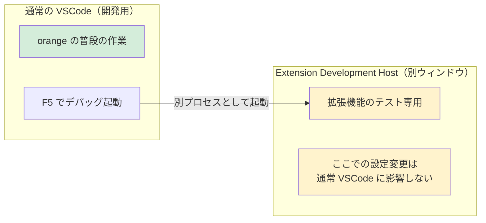
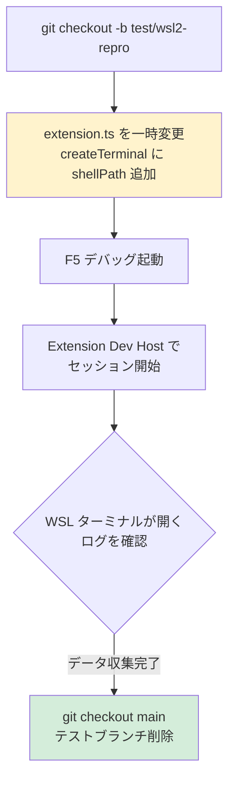

# WSL2 バグ再現環境 — 安全な手順計画

## 目的

WSL2 環境でのみ再現する sendText レースコンディション（Issue #63、3度目）を
手元で再現・計測し、修正の根拠データを得る。

## 完了済み

- [x] Phase 1: WSL2 + Ubuntu インストール（docker-desktop 用 WSL2 が既存。Ubuntu 追加のみ）
- [x] Phase 2: Ubuntu 内に nvm + Node.js セットアップ（Node v24.14.1）
- [x] Phase 3: 再現テスト（2026-03-28 実施）
- [ ] Phase 4: 修正（テスト結果をもとに方針決定）

---

## 影響範囲の整理

### F5 デバッグの仕組み



**重要**: Extension Development Host は**別プロセス・別ウィンドウ**で起動する。
普段の VSCode の設定やターミナルには影響しない。

### 影響範囲マトリックス

| 操作 | 影響範囲 | 普段の作業への影響 | 安全性 |
|------|---------|:-:|:-:|
| F5 デバッグ起動 | 新しいウィンドウが開くだけ | なし | **安全** |
| Extension Dev Host 内でフォルダを開く | Dev Host 内のみ | なし | **安全** |
| Dev Host 内でターミナルプロファイル変更 | Dev Host 内のみ | なし | **安全** |
| **通常 VSCode** のデフォルトプロファイル変更 | **全プロジェクトに影響** | **あり** | **危険** |
| ソースコード一時変更（テスト用ブランチ） | git で元に戻せる | なし | **安全** |
| WSL `.bashrc` に `sleep 3` 追加 | WSL ターミナルが遅くなる | WSL 使用時のみ | **低リスク** |

---

## Phase 3: 再現テスト（安全な方法）

### 方針: コードを一時変更して WSL ターミナルを強制する

デフォルトプロファイルを変更する代わりに、`createTerminal()` に WSL シェルパスを
直接指定するテスト用コード変更を行う。**テスト用ブランチで作業し、終わったら破棄する。**



### 具体的な手順

#### 手順 1: テスト用ブランチ作成（Claude が実行）

```bash
git checkout -b test/wsl2-repro
```

#### 手順 2: コード一時変更（Claude が実行）

`extension.ts` の `createTerminal()` 呼び出し 3 箇所に `shellPath` を追加：

```typescript
// 変更前
const terminal = vscode.window.createTerminal({
  name,
  cwd: projectPath,
  isTransient: true,
});

// 変更後（テスト用）
const terminal = vscode.window.createTerminal({
  name,
  cwd: projectPath,
  isTransient: true,
  shellPath: "wsl.exe",
  shellArgs: ["-d", "Ubuntu"],
});
```

この変更でデフォルトプロファイルに関係なく WSL ターミナルが開く。

#### 手順 3: WSL の .bashrc に遅延追加（orange が実行）

PowerShell で以下を実行：

```powershell
wsl -d Ubuntu -- bash -c "echo 'sleep 3' >> ~/.bashrc"
```

**効果**: bash 初期化が +3秒。Tier2 の 2s 遅延では不十分な条件を作る。
**影響**: WSL Ubuntu を開いたときだけ 3 秒遅くなる。Windows 側は無影響。

#### 手順 4: F5 デバッグ起動（orange が実行）

1. VSCode で `C:\dev\terminal-session-recall` フォルダが開いていることを確認
2. キーボードで `F5` を押す
3. **新しい VSCode ウィンドウ**（タイトルバーに `[Extension Development Host]` と表示）が開く

#### 手順 5: Extension Development Host でテスト（orange が実行）

1. Extension Development Host のウィンドウで、何かフォルダを開く
   - `Ctrl+K` → `Ctrl+O` を押す → 適当なフォルダを選択（例: `C:\dev\terminal-session-recall` 自身でも可）
2. フォルダが開いたら、`Ctrl+Shift+P` を押す
3. 入力欄に `Claude Resurrect` と入力
4. `Claude Resurrect: Show Menu` を選択
5. `Start new session` を選択
6. **WSL ターミナルが開く** — ターミナルの表示内容を確認する：
   - 正常: `$` プロンプトが出て、その後 `claude: command not found` 的なメッセージ
   - エラー再現: `/bin/bash: -c: line 1: unexpected EOF while looking for matching '`

#### 手順 6: ログ確認（orange が実行）

1. **元の VSCode ウィンドウ**（デバッグ元）に `Alt+Tab` で戻る
2. 下部パネルが見えない場合は `Ctrl+J` で表示する
3. 下部パネルの上部にあるタブから **「OUTPUT」** を選択
4. OUTPUT パネルの**右上**にドロップダウンがある → クリックして **「TS Recall」** を選択
5. 表示されたログの中から `sendTextWhenReady` の行を探す

**報告してほしいもの:**
- 手順 6 のターミナル表示内容（正常 or エラー）
- 手順 7 のログに書かれた `sent via` の後の文字列（`tier1:shellIntegration` / `tier2:shellDetected` / `tier3:timeout`）

#### 手順 7: 後片付け（Claude が実行）

```bash
git checkout main
git branch -D test/wsl2-repro
```

WSL の `.bashrc` から `sleep 3` を削除：

```bash
wsl -d Ubuntu -- sed -i '/^sleep 3$/d' ~/.bashrc
```

---

## Phase 3: テスト結果（2026-03-28 実施）

### テスト環境

- Windows 11 Home 10.0.26200
- WSL2 Ubuntu + nvm（Node v24.14.1）
- `.bashrc` に `sleep 3` を追加済み（bash 初期化を意図的に遅延）

### 実験結果

| # | 条件 | Tier | ターミナル結果 |
|:-:|------|------|-------------|
| 1 | WSL + sleep 3（ウォームスタート） | tier2:shellDetected (2s遅延) | **正常**（claude 起動成功） |
| 2 | WSL + sleep 3 + `wsl --shutdown` 後（コールドスタート） | tier2:shellDetected (2s遅延) | **正常**（claude 起動成功） |

### 比較: 通常ターミナル（PowerShell）

| Tier | 結果 |
|------|------|
| tier1:shellIntegration | 正常 |

### 確認できた事実

| # | 質問 | 結果 |
|:-:|------|------|
| 1 | WSL2 で Shell Integration は発火するか | **しない** — 常に Tier2 にフォールバック |
| 2 | sleep 3 + Tier2（2s遅延）でエラーになるか | **ならない** — `sleep` 中は bash がパース中ではないため stdin バッファに溜まり、完了後に正常処理される |
| 3 | コールドスタートで変わるか | **変わらない** — orange の環境では再現せず |

### 考察

- **EOF エラーの手元再現には失敗した**
- `sleep` による遅延は再現条件として不適切。`sleep` 中の bash は行パースをしていないため、stdin に届いたテキストはバッファに溜まり `.bashrc` 完了後に正しく処理される
- 本来のエラーは、bash が**シングルクォートを含む行を能動的にパース中**にテキストが PTY に到達するケースで発生する。これはタイミングがシビアで意図的な再現が難しい
- 報告者の環境固有の要因（より重い `.bashrc`、遅い distro、古い WSL バージョン等）が関わっている可能性がある

### 構造的な弱点（確認済み）

WSL2 では Shell Integration が発火しないため、Tier2（固定遅延）に依存する。
Tier2 の 2s 遅延は orange の環境では十分だが、他の環境で十分である保証はない。

---

## Phase 4: 修正方針（未着手）

テスト結果をもとに方針を決定する。選択肢:

1. **Tier2 遅延を増加 + 設定化** — 2s → 5s にし、`claudeResurrect.shellReadyDelay` で調整可能にする
2. **現状維持** — 手元で再現しない以上、報告者に追加情報を求める
3. **報告者の環境情報を収集** — Issue でログ提出を依頼し、Tier/タイミング情報を得てから判断
