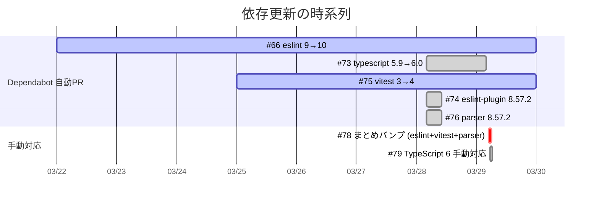
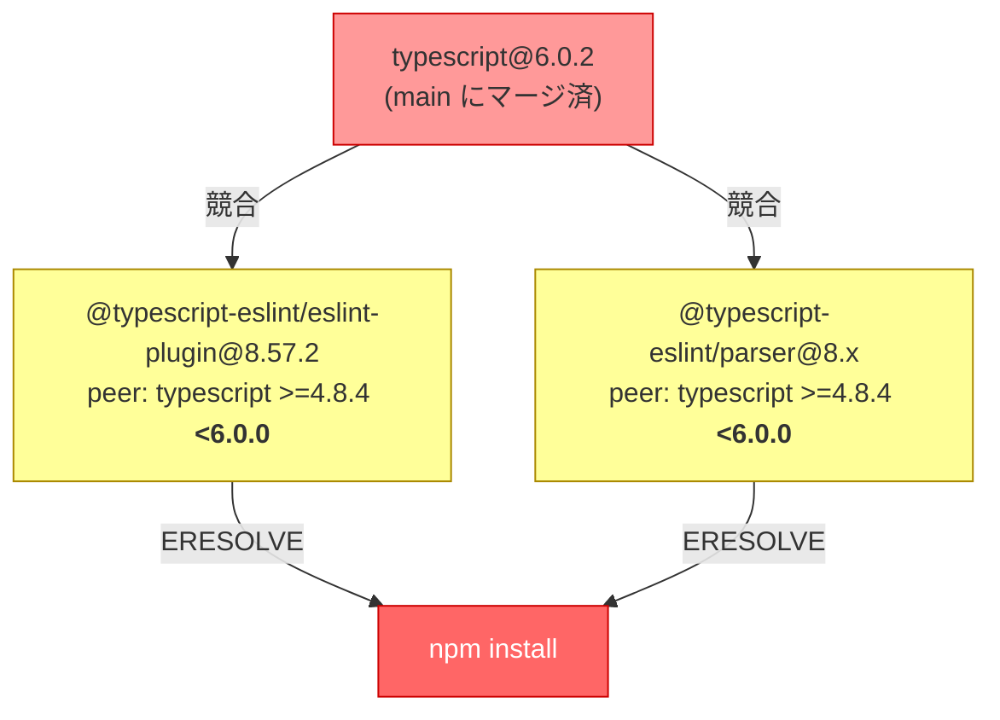
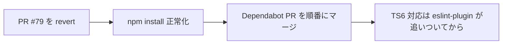

# 依存更新の経緯と現状 (2026-03-29)

## 何が起きたか

### 時系列

### 経緯の詳細

1. **Dependabot が Issue #73 を作成** — `typescript 5.9.3 → 6.0.2` へのバンプ PR を自動生成（3/28）
2. **orange が #73 を手動で対応** — Dependabot の PR だけでは `tsconfig.json` の変更が必要だったため、手動で `chore/typescript-6` ブランチを作成し PR #79 として対応
3. **PR #79 をマージ** — `ignoreDeprecations: "6.0"` と `types: ["node"]` を tsconfig に追加して TypeScript 6 対応完了
4. **PR #78（まとめバンプ）も同時に作成** — eslint, vitest, parser をまとめて上げようとした
5. **PR #79 マージ後に PR #78 がコンフリクト** → 放置状態に（今回クローズ済み）

### 見落とされた問題

PR #79 (TypeScript 6) は品質ゲート（typecheck, test, compile）を通過してマージされたが、**`npm install` が壊れていることに気づかなかった**。

## 現在の壊れ方

**main ブランチで `npm install` が失敗する。** つまり：

- 新しくクローンした人はビルドできない
- CI でも失敗する（lock ファイルからの復元は可能かもしれないが不安定）
- Dependabot PR (#66, #75) もこの問題の上に乗っている

## 原因

`@typescript-eslint/eslint-plugin@8.57.2` と `@typescript-eslint/parser@8.x` が `typescript <6.0.0` を peer dependency として要求している。TypeScript 6 対応版がまだリリースされていない可能性がある。

## Open な依存 PR の状態

| PR | 内容 | マージ可否 | 備考 |
|----|------|:---:|------|
| #66 | eslint 9→10 | ⚠️ | npm install が peer dep で失敗 |
| #75 | vitest 3→4 | ⚠️ | 同上 |

## 対応の選択肢

### A. TypeScript 6 を revert して 5.x に戻す

- **メリット**: すぐ直る。Dependabot PR もマージ可能になる
- **デメリット**: tsconfig の変更も戻す必要がある

### B. @typescript-eslint を TS6 対応版に上げる

- **前提**: 対応バージョンが存在するか調査が必要
- **メリット**: 前に進める
- **デメリット**: 対応版がなければ行き止まり

### C. `--legacy-peer-deps` で一時回避

- **メリット**: 一応動く
- **デメリット**: 根本解決ではない。他の開発者が踏む

## 推奨

**選択肢 A（revert）** を推奨。理由：

- OSS プロジェクトとして、main が壊れている状態は最優先で修正すべき
- TypeScript 6 はエコシステムが追いつくまで待つのが安全
- revert 後に Dependabot PR (#66, #75) を順番にマージできる
